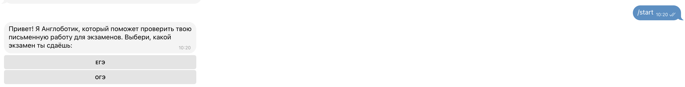

  

---

 Anglobotik is a bot that was developed by me for an English teacher to automize their process of checking essays and letters for an exam.
      

## 📝 Table of Contents

- [About](#about)
- [Demo / Working](#demo)
- [How it works](#working)
- [Built Using](#built_using)
- [Authors](#authors)
- [Acknowledgments](#acknowledgement)
- [TODO](#TODO.md)

## 🧐 About 

The main purpose of the bot is for people to have a free AI checker for russian speaking student to check their essays before the exam for better results.

Also, the bot has a paid option for a real teacher to check the essay for people to be sure that they are prepared for the exam.

## 🎥 Demo / Working 

## 💭 How it works 

The bot is written in python 3.12. 

When a user types /start using Telegram api with a library of python-telegram-bot and changes the message, including the inline keyboard.

When a user decides to check using the AI, the bot will ask for the text to check, and then send it to the function written inside main/src/ai/ai.py, which 

Beep boop. I am a bot. If there are any issues, contact my [Master](https://linktr.ee/andrinoff)

Want to make a similar reddit bot? Check out: [GitHub](https://github.com/andrinoff)

## ⛏️ Built Using 

- [python-telegram-bot](https://python-telegram-bot.org) - Python Telegram API Wrapper
- [OpenAI](https://openai.com) - OpenAI ChatGPT API

## ✍️ Authors 

- [@andrinoff](https://github.com/andrinoff) - developer
- [@ah_polinka](https://instagram.com/pelageeyaaa) - Idea and funds

## 🎉 Acknowledgements 

- Hat tip to anyone whose code was used
